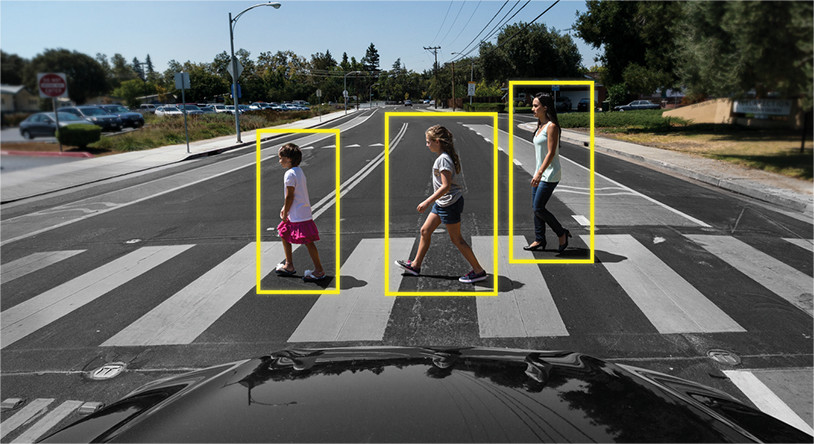

# Advanced Driver Assistance System (ADAS) using SSD (Single Shot MultiBox Object Detector) based on Tensorflow

Goal of this project is a deployment of Advanced Driver Assistance System (ADAS) with road sign detection, red light detection 
and pedestrian detection sub systems. 
The final product is an embedded system equipped with camera that in real-time gives alarm in the case of facing red light, 
stop sign and pedestrian. 
This project has two main steps: 
In the first step, I implemented the SSD object detection based on mobilenet backbone network which is finetuned for new 
object detection such as traffic sign and redlight.
In the second step, I deploy the inference part based on mobilenet backbone on embedded system (Dragon board 410C) using C++ to 
have real-time performance. 

  

